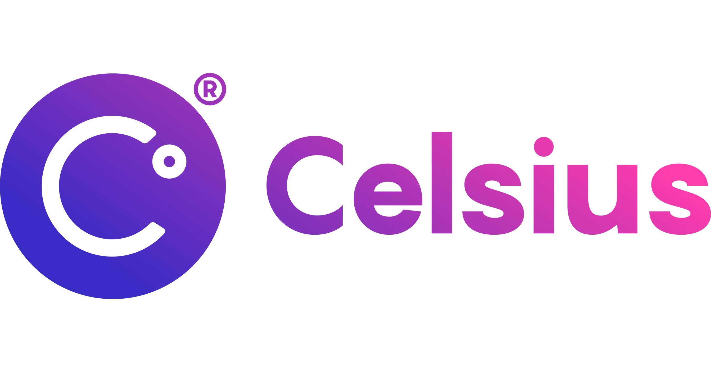
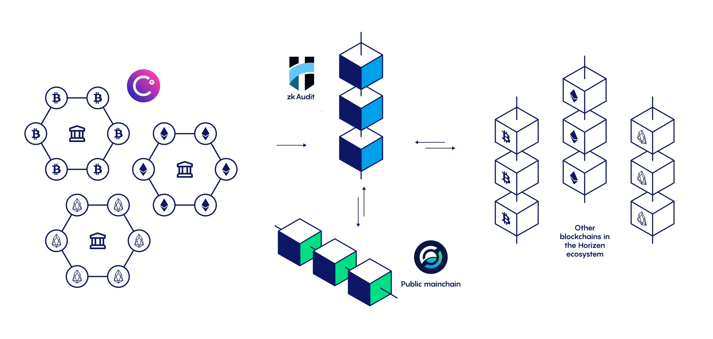
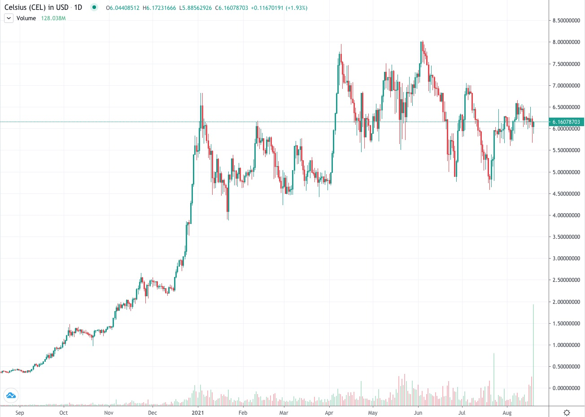

# Celsius-Network-Case-Study

# Celsius Network Case Study

## Overview & Origin:
- Celsius Network, a peer-to-peer cryptocurrency lending and borrowing platform.

- The company was founded in 2017 by Alex Mashinsky, Daniel Leon and Nuke Goldstein.
 

[Alex Mashinsky](https://www.mashinsky.com/about) is a serial entrepreneur who has founded two of New York's City's top 10 venture-backed exits since 2000. He is one of the inventors of VOIP (Voice Over Internet Protocol) and has over 35 patents relating to exchanges VOIP protocols, messaging and communication. With over $1 billion raised and over $3 billion in exits, he is one of the most experienced and loudest voices in crypto. 

[Daniel Leon](https://celsius.network/bio/S.Daniel%20Leon) has co-founded and led multiple companies and non-profit organizations. Prior to joining Alex and co-founding Celsius Network he was a managing partner at Governing Dynamics, he was CEO of Atlis Labs, Beyon3D and chairman at Here0. Daniel was also general manager of GroundLink, which raised more than $30 million in funding during his career.

Before working on the Celsius crypto assets lending and borrowing platform [Nuke Goldstein](https://celsius.network/bio/Nuke%20Goldstein) designed P2P credit protocols using distributed storage and smart-contracts. Nuke was the CEO and founder of Sevenpop, a leading interactive music technology provider to hundreds of hotels and shopping centers across Israel.  

- According to the [Celsius Network](https://celsius.network/about-us) website, Alex Mashinsky and Daniel drew up the plan for Celsius on a coffee shop napkin. Both were exhausted by a system that continues to benefit the top 1% while punishing the 99%. They understood quite clearly that securities lending could be replicated in the cryptocurrency ecosystem. However, in their system the profits earned by Celsius are not distributed to shareholders, instead 80% of profits would be distributed amongst the community of depositors.
 
- [ICO Drops](https://icodrops.com/celsius/) reports that $50 million was raised from a token sale in March of 2018. The sale was closed to most US investors as accredited US investors and foreign investors were only able to participate.

## Business Activities: 
**What specific financial problem is the company or project trying to solve?**
- Celsius Network is building a community of borrowers and lenders with the aim of replacing Wall Street with blockchain. They believe Traditional financial institutions should no longer control the flow of credit. Their [white paper](https://celsius.network/static/media/celsius-whitepaper.27574611.pdf) explains in detail how they want to use a consensus-based proof-of-stake approach for the community to lend and vouch for one-another creating a self governed credit ecosystem where everyone wins.

**Who is the company's intended customer?  Is there any information about the market size of this set of customers?**
- Their target audience are long term cryptocurrency HOLDers who would like to put their money to work by earning yield on those assets. Celsius Network also attracts crypto holders who want to take loans against their digital assets for cash (or stable coins) with a small interest rate without the need to sell their cryptos. Founder, [Alex Mashinsky](https://mashinsky.medium.com/cant-stop-won-t-stop-2021-a-year-of-milestones-for-celsius-8af2cf496c89) explains in his medium post that this technology can help drive the next 100 million people into the cryptocurrency space. [Celsius Network](https://celsius.network/) claims their platform currently has 942k users across 150 countries.

**What solution does this company offer that their competitors do not or cannot offer? (What is the unfair advantage they utilize?)**
- Celsius Network offers zero fees, no gas fees, transfer fees, no origination or withdrawal fees. In addition you have the option of 40+ collateral options and the lowest industry rate for loans starting at 1% apr.

**Which technologies are they currently using, and how are they implementing them?**
- Celsius Network uses blockchain technologies for their phone/web wallet application. They have implemented their platform to use the most popular blockchains including Bitcoin, Ethereum, Cardano, Litecoin, Luna, Polkadot and more. 

- The company uses a custodian called Fireblocks that stores customer funds safely. Through Fireblocks Celsius is able to access Defi protocols which help fund Celsius’s revenue stream. 

- Celsius participates in Bitcoin mining and is one of the largest investor in bitcoin mining in the United States according to [PRNewswire](https://www.prnewswire.com/news-releases/celsius-invests-over-200m-in-bitcoin-mining-in-north-america-301306009.html). Newly minted bitcoin is used to help pay yield to depositors on a weekly basis.

- Celsius Network has recently released their Rewards Explorer, an interactive platform that you can access via the web or the mobile application. With the Rewards Explorer you have a transparent way to see rates and different variables that go into calculation of weekly crypto payment rewards. 

- Another notable technology that Celsius Network is implementing is zero-knowledge audits (zkAudit) through a collaboration with [Horizen Labs](https://celsius.network/horizen-labs). This gives a third party transparent audit of the Celsius community assets without disclosing any private customer information. Below is diagram that shows how this technology works.

1. Celsius sends zero-knowledge proofs of private data to zkAudit for verification

2. zkAudit has access to the transactions that occurred on different blockchains in an encrypted and aggregated format.

3. The private data is verified against the aggregated data and added to the zkAudit ledger as proof of community assets.

4. ZEN is transferred back and forth between the Horizen public mainchain and zkAudit, maintaining the decentralization and data integrity.

## Landscape:

**What domain of the financial industry is the company in?**
- Celsius Network is a P2P Crypto currency lending and borrowing platform.

**What have been the major trends and innovations of this domain over the last 5-10 years?**
- The major trends in the cryptocurrency lending and borrowing space include decentralized finance, decentralized applications, decentralized exchanges yield farming, proof-of-stake crypto collateral loans.

**What are the other major companies in this domain?**

Celsius Network largest competitors include:
- Blockfi
- Blockfolio
- Nexo
- Coinbase
- Binance

## Results

**What are some of the core metrics that companies in this domain use to measure success? How is your company performing, based on these metrics?**

- Celsius Network has performed extremely well over the last two years in part with the crypto bull market of 2020/2021. They have paid the community a total of $437 million dollars on 40+ crypto assets in the last 12 months and have a total of $17.1 billion dollars of community assets under management. Alpha Sigma Capital has determined that Celsius Network is currently valued at $3.1 billion according to [CoinTelegraph](https://cointelegraph.com/news/celsius-network-valued-at-3-1b-following-independent-review)

- The CEL token, a utility token that allows you to earn up to 25% more rewards, and 25% discount on loans on the Celsius Network has increased by 1,603.8%. It is currently ranked 49th on [coinpaprika](https://coinpaprika.com/coin/cel-celsius/) and has a market cap of $2,768,675,830 at the time of this writing.

**How is your company performing relative to competitors in the same domain?**

- Celsius Network is leading the lending and borrowing sector in the crypto space with their sights set on disrupting the entire financial industry. Celsius continues to provide the highest rate on yield and the lowest apr on loans. 

**If you were to advise the company, what products or services would you suggest they offer?**

- The company would greatly benefit by improving their fiat on and off ramps and adding in app cryptocurrency swap mechanism.

**Why do you think that offering this product or service would benefit the company?**

- It would be easier for new community members/non-native crypto users to be on-boarded to the platform if they had an easier way to get money on/off the app. As it stands you have to transfer your money out of the app to another platform to sell or trade your crypto assets. This can often be frustrating for the average user as other platforms do already provide these solutions. 

**What technologies would this additional product or service utilize?**

- This service would utilize ACH transfers or instant transfer services like Visa Fast Funds or mastercard send. Coinbases uses a service called plaid to attach your bank account to the platform so you can easily use your debit or credit card.

**Why are these technologies appropriate for your solution?**
- These technologies are already adopted by other large and reputable companies that have large customer bases who continue to use these solutions over Celsius Network. I still use Coinbase and FTX to purchase cryptocurrencies to transfer onto Celsius. I would rather purchase my tokens directly from Celsius.

**Resources**
1. [Celsius Network](https://celsius.network/)
2. [Celsius Network White Paper](https://celsius.network/static/media/celsius-whitepaper.27574611.pdf)
3. [CoinGecko](https://www.coingecko.com/en/coins/celsius-network-token)
4. [ICODrops](https://icodrops.com/celsius/)
5. [Alex Mashinsky Medium](https://mashinsky.medium.com/cant-stop-won-t-stop-2021-a-year-of-milestones-for-celsius-8af2cf496c89)
6. [Coinpaprika](https://coinpaprika.com/coin/cel-celsius/)
7. [zkAudit](https://celsius.network/horizen-labs)
8. [PR Newswire](https://www.prnewswire.com/news-releases/celsius-invests-over-200m-in-bitcoin-mining-in-north-america-301306009.html)
